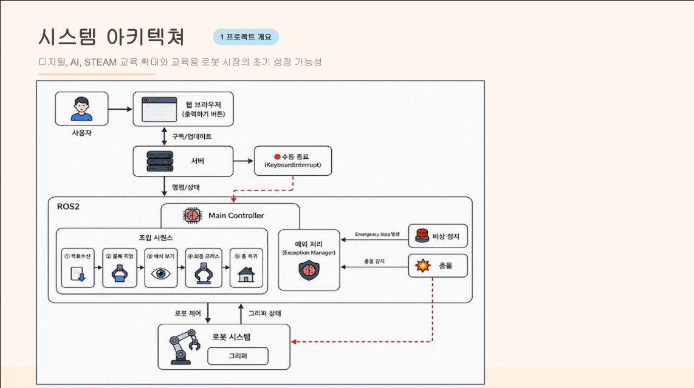
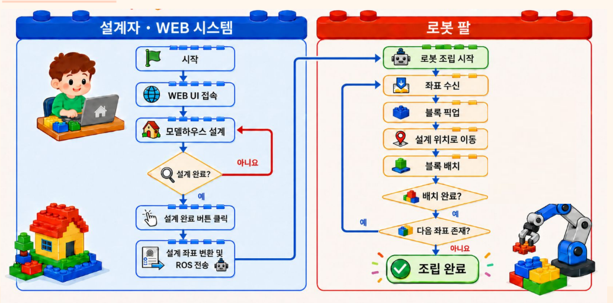

# HOME CRAFT (사용자의 건축 아이디어를 로봇팔로 실제 모형화하는 융합형 교육 시스템)
> **C-3:** [C-3 - ROKEY]
> **팀원:** [방현식_유상우_황재문_김찬혁]

---
## 1. 시스템 설계 및 플로우 차트

### 1-1. 시스템 설계도 (System Architecture)
<p align ="center">
  
</p>
 * * 설명: [pc와 매니퓰레이터 간의 통신 구조를 나타냅니다.] *

### 1-2. 플로우 차트 (Flow chart)
<p align ="center">
  
</p>
* * 설명: [UI부터 전체 프로세스 진행도를 나타냅니다.]*

## 2. 운영체제 환경

권장/테스트 기준:

- **OS**: Ubuntu 22.04 LTS
- **ROS 2**: Humble Hawksbill
- **Python**: 3.10.x (ROS 2 Humble 기본)
- **로봇 드라이버/패키지**
  - `dsr_bringup2` (두산 로봇 브링업)
  - `DSR_ROBOT2`, `DR_common2`, `DR_init` (Python API, 두산 로봇 제어)

---

## 3. 사용한 장비 목록

- **로봇**: Doosan Robotics **M0609** (코드 기본값: `ROBOT_ID="dsr01"`, `ROBOT_MODEL="m0609"`)
- **컨트롤/네트워크**
  - 로봇 컨트롤러(이더넷 연결)
  - ROS 2 실행 PC(워크스테이션) — 웹 서버(`final_server`)도 같은 PC에서 구동, 같은 네트워크의 다른 기기에서 브라우저로 접속 가능
- **엔드이펙터**
  - DO 기반 그리퍼 (기본 DO 채널: 1/2/3, open/close/full-close)
  - (옵션) **OnRobot RG2** — Modbus TCP 직접 제어(컴퓨트 박스 기본 IP `192.168.1.1:502`), 부분 열기(코너 릴리즈)에 사용, 미연결 시 DO 방식으로 자동 대체
- **워크셀 구성 요소(프로젝트 범위)**
  - 레고 블록(1x1, 1x2, 2x2, 2x3), 조립판
  - 브라우저 UI(Three.js) 구동 PC/기기

---

## 4. 의존성 (requirements.txt)

이 프로젝트는 ROS 2 패키지(apt) + Python 패키지(pip)를 함께 사용합니다.

### ROS 2 (apt) 예시
- `rclpy`
- `std_msgs`
- `ament_index_python`
- (두산 드라이버) `dsr_bringup2`, `DSR_ROBOT2` 제공 패키지

### Python (pip): `requirements.txt`
```txt
pymodbus>=3.0
```

> `pymodbus`는 OnRobot RG2 그리퍼 부분 열기(Modbus TCP 직접 제어)에만 필요합니다.  
> 설치되어 있지 않거나 컴퓨트 박스 연결에 실패해도, 그리퍼는 DO 방식으로 자동 대체되어 동작합니다.  
> 웹 서버(`final_server`)는 표준 라이브러리(`http.server`, `socketserver` 등)만 사용하며 추가 pip 패키지가 필요하지 않습니다.

---

## 5. 간단 사용 설명 (launch 순서 및 스크립트)

### (A) 워크스페이스 빌드

```bash
# ROS 2 환경
source /opt/ros/humble/setup.bash

# 워크스페이스 예시
mkdir -p ~/lego_ws/src
cd ~/lego_ws/src

# 이 저장소의 src/ 내용을 복사/클론했다고 가정
cd ~/lego_ws
colcon build --symlink-install
source install/setup.bash
```

### (B) 실행 순서

> 실행 순서: (두산 bringup) → **rokey_move**(로봇 제어) → **final**(웹 서버, 자동으로 브라우저 오픈)

```bash
# 1) 두산 로봇 브링업 (실제 로봇/시뮬레이터)
ros2 launch dsr_bringup2 dsr_bringup2.launch.py mode:=real host:=192.168.1.100

# 2) 로봇 제어 노드
ros2 run <pkg> test2

# 3) 웹 서버 노드 (기본 포트 8080, 실행 시 브라우저 자동 오픈)
ros2 run final final
```

- 웹 서버 접속: `http://localhost:8080` (또는 자동 재할당된 포트, 같은 네트워크에서는 `http://<PC_IP>:8080`)
- 파라미터
  - `port` (int, 기본 `8080`) : 포트가 사용 중이면 8081, 8082 … 순으로 최대 10회 자동 재시도
  - `host` (string, 기본 `'0.0.0.0'`) : 같은 네트워크의 다른 기기에서도 접속 가능
  - `sav_path` (string, 기본 `'~/lego_map_saves'`) : 맵 저장/불러오기 폴더

```bash
ros2 run final final --ros-args -p port:=9090 -p sav_path:=~/my_lego_maps
```

### (C) 사용 흐름

1. 브라우저 UI에서 레고 블록을 배치해 도면을 구성
2. "출력하기" 클릭 → `/api/publish_centers` → `/centers` 토픽 발행
3. `rokey_move`가 신규 블록만 필터링해 순차적으로 픽업/조립
4. 웹 UI는 `/api/progress`를 폴링해 현재 조립 중인 블록을 표시
5. 조립판을 손으로 치웠다면 `/reset_blocks` 발행(또는 웹 리셋 기능)으로 이력 초기화

---

## 참고: 선택적 모듈

- `final.recovery_controller.CollisionRecoveryNode`, `final.manual_controller.InterruptManualController`
  - 충돌 복구(Recovery) 및 중단 시 수동 조작(Manual Jog) 기능을 담당하는 선택적 모듈입니다.
  - import에 실패해도(미설치/미포함) 웹 서버와 로봇 조립 핵심 기능은 정상 동작하며, 관련 REST API(`/api/recovery/*`, `/api/manual/*`)만 비활성화됩니다.

---

## 라이선스

- 패키지 라이선스: 각 패키지(`final`, `rokey_move` 소속 패키지)의 `LICENSE` 파일 참고
